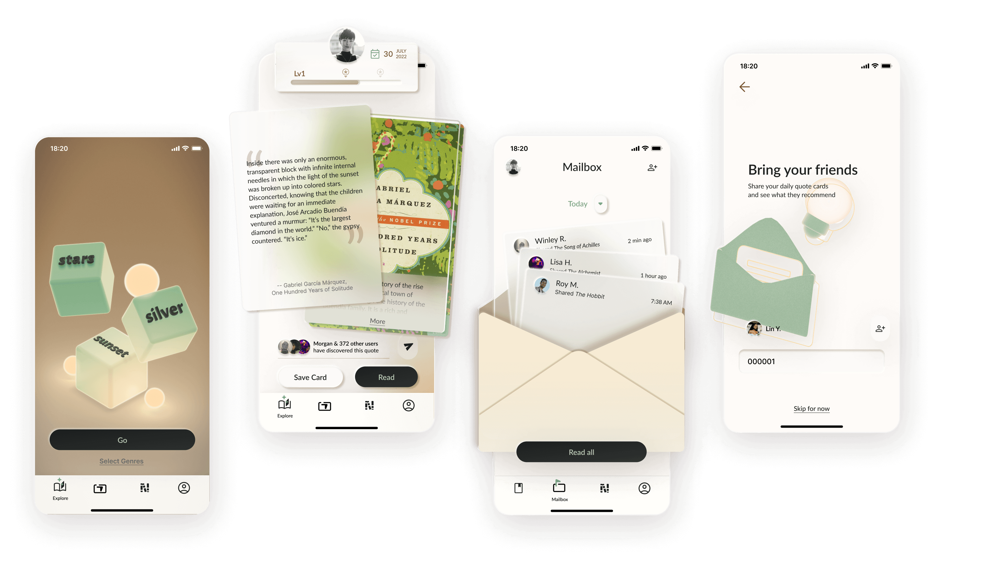

---
# frontmatter
layout: ../../layouts/MarkdownProjectLayout.astro
title: 'Cubbie'
description: 'This is the first post of my new Astro blog.'
coverImage:
    url: '/cubbie-cover.png'
    alt: 'The Astro logo on a dark background with a pink glow.'
tags: ["astro", "blogging", "learning in public"]
detail1:
    title: ['Role']
    content: ["UX Design", "User Research", "Branding"]
detail2:
    title: ['Team']
    content: ["Solo Project"]
links:
    url: ['https://docs.astro.build/en/getting-started/','https://docs.astro.build/en/']
    title: ['LinkA','LinkB']

---

# My First Blog Post

Welcome to my _new blog_ about learning Astro! Here, I will share my learning journey as I build a new website.

## What I've accomplished

1. **Installing Astro**: First, I created a new Astro project and set up my online accounts.

2. **Making Pages**: I then learned how to make pages by creating new `.astro` files and placing them in the `src/pages/` folder.

3. **Making Blog Posts**: This is my first blog post! I now have Astro pages and Markdown posts!

## What's next

I will finish the Astro tutorial, and then keep adding more posts. Watch this space for more to come.

[links](https://astro.build)